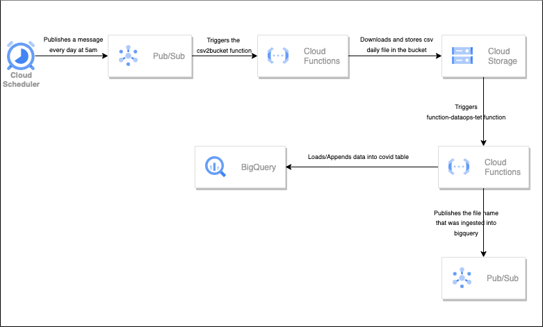

# FPAY-data-Infra

## SOLUTION ARCHITECTURE



## - HOW TO USE THIS REPO 
### 1) Set GCP AUTH Credentials and GCP_Project Enviroment Variables
```
echo $GCLOUD_PROJECT 
echo $GOOGLE_APPLICATION_CREDENTIALS
```
### 2) Init Terraform from the base of the repo
``` 
terraform init 
``` 
### 3) Apply terraform plans
``` 
terraform apply
``` 
### 4) Destroy reources
``` 
terraform destroy
``` 
>
>
> All variables have a default value so no tfvars file is needed however if you want to change the configuration you should create it. 


## - SQL Queries can be found in this same repo at ./Covid_Queries.sql or in the bigquery service created as Views

```
-- Query 1

CREATE VIEW ipachon-test.dt_test.Query_1 AS(
SELECT a.date, a.state, a.deaths FROM `ipachon-test.dt_test.covid` a 
JOIN(
SELECT date, MAX(deaths) deaths FROM `ipachon-test.dt_test.covid`
GROUP BY date) b ON a.deaths=b.deaths and a.date = b.date
ORDER BY date); 

-- Query 2

CREATE VIEW ipachon-test.dt_test.Query_2 AS (
SELECT *,
CASE 
WHEN RIGHT(state,1) <> 'e' then  concat('000', state , '999') 
ELSE state
END
as custom_code FROM `ipachon-test.dt_test.covid`) ;
```